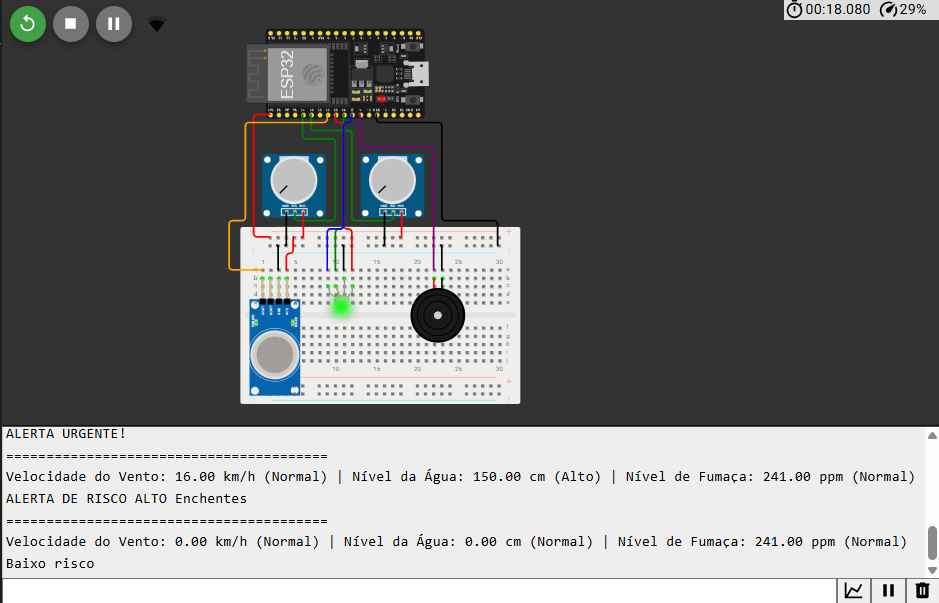
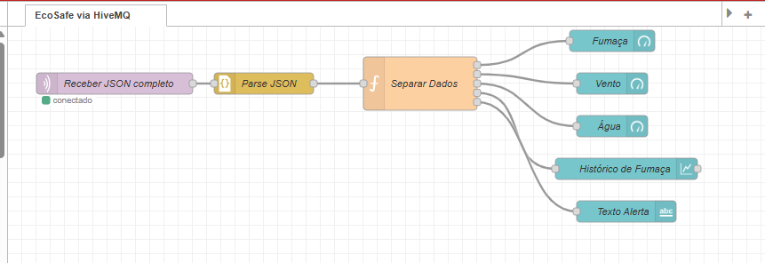
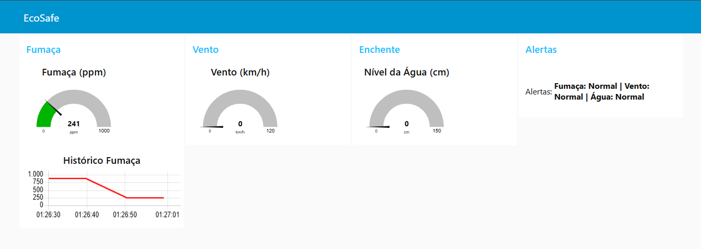

# Projeto de Monitoramento em Tempo Real com IoT e Node-RED

## Apresentação do Projeto

Este projeto propõe uma solução de monitoramento em tempo real utilizando dispositivos IoT simulados na plataforma **Wokwi**, com integração via **Node-RED** e visualização de dados em um **dashboard web**. A ideia principal é oferecer uma interface simples e eficaz para acompanhar dados de sensores em tempo real, com foco em acessibilidade, escalabilidade e comunicação eficiente usando protocolos **MQTT** e **JSON**.

---

## Como Rodar o Sistema

### Requisitos

- Conta ativa na plataforma Wokwi
- Microcontrolador virtual (ESP32 ou Arduino com WiFi) com sensores simulados
- Node.js instalado (v14 ou superior)
- Node-RED instalado (`npm install -g node-red`)

### Passo a Passo para Rodar

1. **Configure seu dispositivo virtual no Wokwi**:
   - Acesse o site da Wokwi e crie um novo projeto.
   - Escolha o microcontrolador (ex: ESP32) e adicione sensores ao circuito.
   - No código, configure a conexão MQTT com o broker desejado (ex: `test.mosquitto.org` ou um broker local).

2. **Programe seu dispositivo com o código Arduino/ESP32**:
   - O código se conecta via WiFi e publica dados usando protocolo MQTT.
   - O payload dos dados é formatado em JSON.  
   Exemplo:
   ```cpp
   {
     "temperatura": 26.5,
     "umidade": 40.1
   }
   ```

3. **Configure o Node-RED**:
   - Inicie o Node-RED com o comando:
     ```bash
     node-red
     ```
   - Acesse o fluxo pelo navegador em:
     ```
     http://localhost:1880
     ```
   - Importe o fluxo do projeto (`flow.json`) e configure as credenciais MQTT de acordo com o broker usado na Wokwi.

4. **Acesse o Dashboard**:
   - Após iniciar o fluxo, visualize o dashboard em:
     ```
     http://localhost:1880/ui
     ```

---

## Explicação Técnica com Base nos Requisitos

### Código e Hardware no Wokwi

O hardware virtual (ESP32 ou Arduino) simula sensores como temperatura, umidade e luminosidade. Esses dados são coletados e enviados para um broker MQTT (público ou local). O código embarcado utiliza bibliotecas como `WiFi.h` e `PubSubClient.h` para estabelecer a comunicação via MQTT.

Os dados são estruturados em **JSON**, o que facilita o tratamento no Node-RED e a visualização no dashboard.

---

## Dashboard para Monitoramento em Tempo Real

O dashboard foi criado no **Node-RED** com o pacote `node-red-dashboard`, permitindo acompanhar os dados em tempo real de forma visual.

Para acessá-lo:
- Inicie o Node-RED
- Acesse: `http://localhost:1880/ui`
- O dashboard exibe **gráficos**, **gauges**, e **indicadores** dos dados enviados pelos sensores.

---

## Gateway: Node-RED com Fluxo de Dados

O **Node-RED** atua como um gateway entre o dispositivo IoT e o dashboard, recebendo os dados MQTT e processando o JSON recebido. O fluxo Node-RED inclui:

- Conexão com broker MQTT
- Parsers JSON para leitura de dados
- Funções de lógica (alertas, filtros)
- Widgets do dashboard (gauge, gráfico, texto)

Esse fluxo pode ser adaptado em tempo real conforme novas necessidades.

---

## Protocolos Utilizados: MQTT e JSON

### MQTT (Message Queuing Telemetry Transport)

É o protocolo usado para comunicação leve entre o dispositivo e o gateway. Ele permite que os dados sejam enviados em tempo real com baixo consumo de banda e energia. É ideal para aplicações IoT.

- Broker usado: `test.mosquitto.org` ou broker local
- Porta padrão: 1883
- Tópicos de publicação: definidos no código da Wokwi (ex: `sensor/temperatura`)

### JSON (JavaScript Object Notation)

Os dados enviados via MQTT estão estruturados em formato JSON. Isso permite:

- Leitura simples e organizada
- Integração direta com o Node-RED
- Compatibilidade com dashboards e APIs web

---

## Imagens do Funcionamento do Sistema

### 1. Simulação no Wokwi


### 2. Estrutura do Fluxo no Node-RED


### 3. Dashboard em Tempo Real no Node-RED


---

## Conclusão

Com essa estrutura, o projeto oferece uma solução IoT de baixo custo, eficiente e escalável, permitindo a visualização de dados de sensores em tempo real com tecnologias modernas e acessíveis, mesmo em ambientes simulados como o Wokwi.

---

## Participantes

- **Pedro Gomes** – RM 553907  
- **Luiz Felipe Abreu** – RM 555197  
- **Matheus Munuera** – RM 557812

---

### Link do projeto Wokwi

 🔗 link: https://wokwi.com/projects/432261047943865345